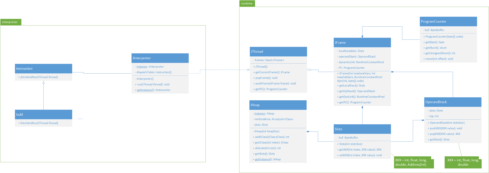

# VJVM

VJVM implements some of The Java® Virtual Machine Specification (Java SE 8 Edition), namely a JVM.

It consists of three parts:

- A CLI interface
- A class loader
- A bytecode interpreter
- Runtime structures

## CLI Interface

The CLI interface gathers command line options, and uses these options to launch VJVM.  
For usage, see [Usage](Usage.md).

## Class Loader

As defined in the JVM spec, a class loader finds the binary representation of a class or interface type with a particular name and creates a class or interface from that binary representation[^1].

## Bytecode Interpreter

The design of interpreter and related classes is shown below.

[^1]: The Java® Virtual Machine Specification (Java SE 8 Edition) <https://docs.oracle.com/javase/specs/jvms/se8/html/jvms-5.html>
